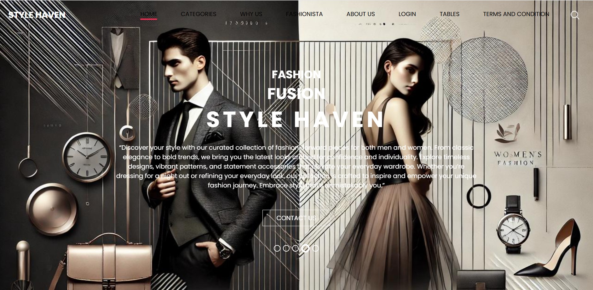
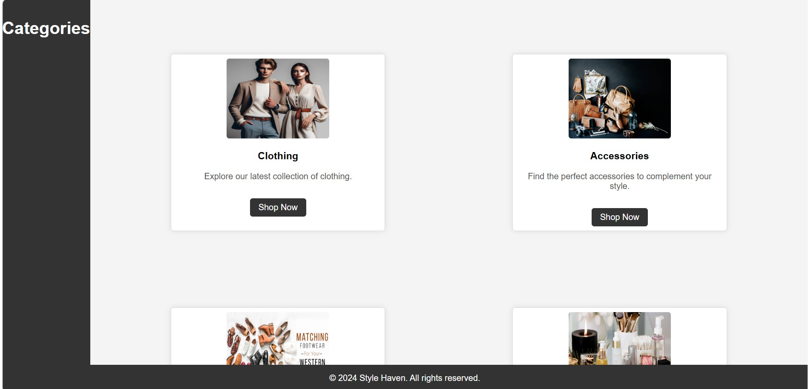
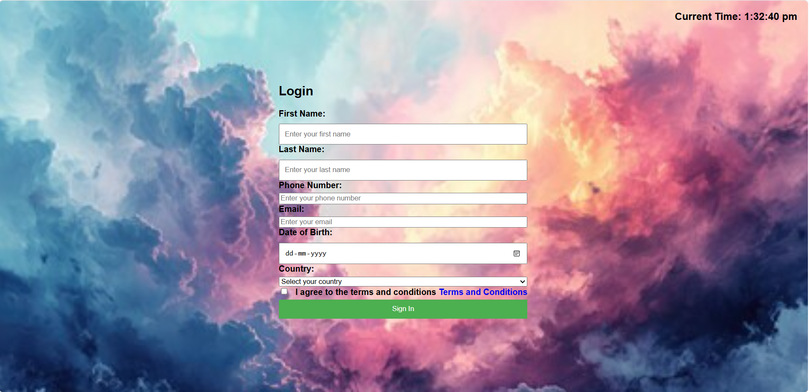

# Style Haven

Style Haven is a responsive fashion and lifestyle e-commerce website built using HTML, CSS, SCSS, Bootstrap, and JavaScript. The project provides a modern online shopping experience with multiple product categories, user account management pages, and a clean, user-friendly interface.

## Features

* Responsive and mobile-friendly design
* Modern e-commerce user interface
* Product category pages

  * Clothing
  * Footwear
  * Accessories
  * Cosmetics
* User account and profile pages
* Form validation using JavaScript
* Bootstrap-based layout and components
* Organized project structure for easy maintenance

## Technologies Used

* HTML5
* CSS3
* SCSS
* Bootstrap
* JavaScript

## Project Structure

```text
Style-Haven/
│
├── html/             # Website pages
├── css/              # Stylesheets
├── scss/             # SCSS source files
├── js/               # JavaScript files
├── images/           # Product and UI images
└── assets/           # Additional resources
```

## Getting Started

### Prerequisites

* Any modern web browser
* Code editor (VS Code recommended)

### Installation

1. Clone the repository:

```bash
git clone https://github.com/your-username/style-haven.git
```

2. Open the project folder:

```bash
cd style-haven
```

3. Launch the main HTML file in your browser.

## Screenshots

## Screenshots

### Home Page



### Categories Page



### Login Page


## Future Enhancements

* Shopping cart functionality
* Product search and filtering
* Wishlist feature
* User authentication
* Payment gateway integration
* Backend and database support

## Contributing

Contributions are welcome. Feel free to fork the repository and submit a pull request with improvements.

## License

This project is intended for educational and portfolio purposes. Feel free to modify and use it according to your requirements.

## Author

**Nandana**

Created as a front-end web development project to demonstrate responsive design, UI development, and e-commerce website structure.
